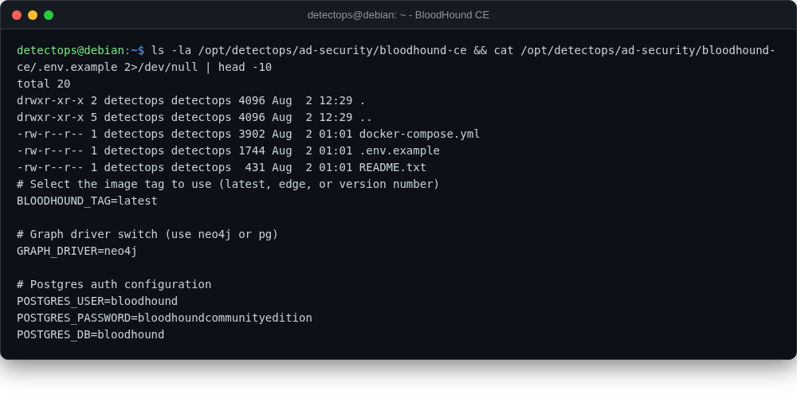

# BloodHound CE

<span class="cat-badge" style="background:#8291B8">compose</span>

Maps AD attack paths graphically. Ships as a Docker stack upstream, not a binary.



## Location

`/opt/detectops/ad-security/bloodhound-ce`

## How to run

```bash
cp .env.example .env && docker-compose up -d
```

!!! warning "Manual step required"
    needs internet the first time to pull images


## Reference

[https://github.com/SpecterOps/BloodHound](https://github.com/SpecterOps/BloodHound)

---

*Part of the **AD & Enterprise Security** toolset in DetectOps.*
