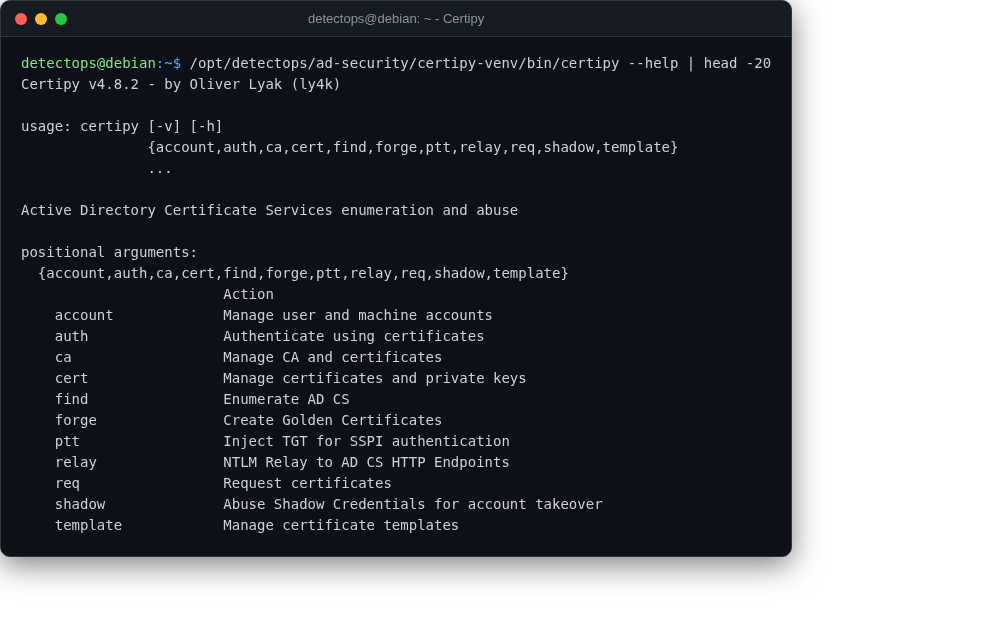

# Certipy

<span class="cat-badge" style="background:#8291B8">venv</span>

Finds and abuses AD Certificate Services (ESC1-style) misconfigurations.



## Location

`/opt/detectops/ad-security/certipy-venv`

## How to run

```bash
certipy-venv/bin/certipy find -u user@domain -p pass -dc-ip dc-ip
```

---

*Part of the **AD & Enterprise Security** toolset in DetectOps.*
