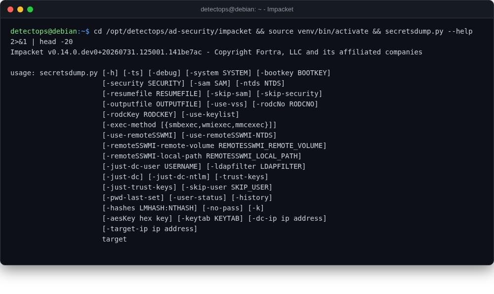

# Impacket

<span class="cat-badge" style="background:#8291B8">venv</span>

The reference library/scripts for Windows protocol abuse (SMB, Kerberos, DCOM…).



## Location

`/opt/detectops/ad-security/impacket`

## How to run

```bash
source venv/bin/activate && secretsdump.py domain/user:pass@dc-ip
```

## Reference

[https://github.com/fortra/impacket](https://github.com/fortra/impacket)

---

*Part of the **AD & Enterprise Security** toolset in DetectOps.*
