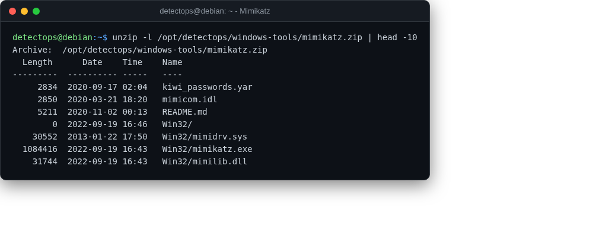

# Mimikatz

staged

Credential extraction from Windows memory — staged, Windows-only.

## Location

`/opt/detectops/windows-tools/mimikatz.zip`

!!! info "Windows-only"
    authorized engagements only

## Reference

[https://github.com/gentilkiwi/mimikatz](https://github.com/gentilkiwi/mimikatz)

---

*Part of the **AD & Enterprise Security** toolset in DetectOps.*
