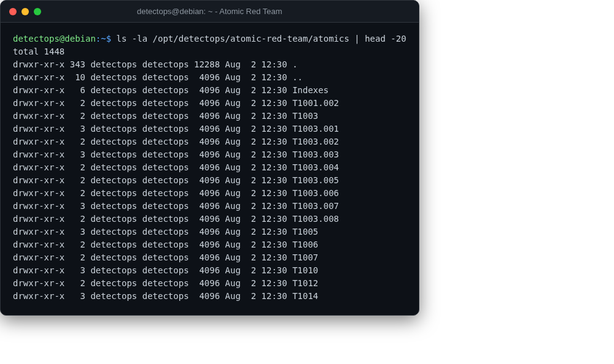

# Atomic Red Team

<span class="cat-badge" style="background:#D9724C">tests</span>

RedCanary's library of small, atomic ATT&CK technique tests.



## Location

`/opt/detectops/atomic-red-team` (tests in `atomics/`)

## How to run

```bash
pwsh
Invoke-AtomicTest T1082
```

---

*Part of the **Attack Simulation** toolset in DetectOps.*
