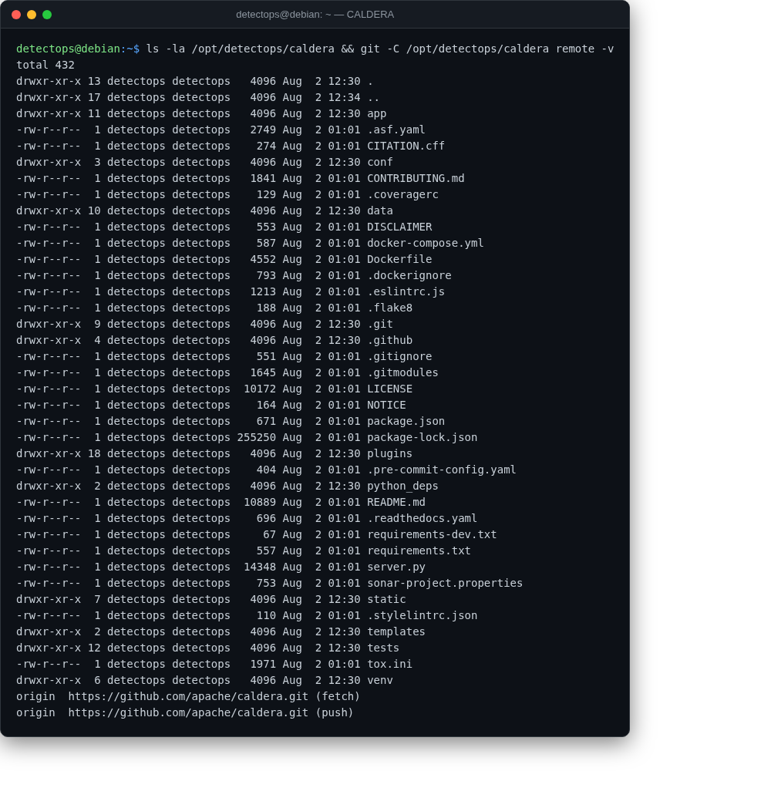

# CALDERA

<span class="cat-badge" style="background:#D9724C">C2 / BAS</span>

MITRE's automated adversary emulation platform. Full offline pip cache, so it never needs the internet.



## Location

`/opt/detectops/caldera`

## How to run

```bash
cd /opt/detectops/caldera && source venv/bin/activate
python3 server.py --insecure   # or: start-caldera, or menu → 1
```

!!! note
    browse to `http://<vm-ip>:8888` — red/blue credentials print to the console on first start


---

*Part of the **Attack Simulation** toolset in DetectOps.*
