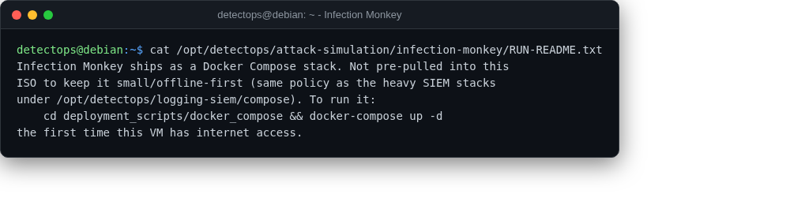

# Infection Monkey

<span class="cat-badge" style="background:#D9724C">manual</span>

Guardicore's automated breach-and-attack-simulation platform.



## Location

`/opt/detectops/attack-simulation/infection-monkey` · see `RUN-README.txt`

## How to run

```bash
sudo docker pull mongo:6.0 && sudo docker pull infectionmonkey/monkey-island:latest
sudo docker run --name monkey-mongo --network=host --volume monkey-db:/data/db --detach mongo:6.0
# then start Monkey Island per docs/content/setup/docker.md (step 3) in the vendored repo
```

!!! warning "Manual step required"
    no docker-compose.yml ships for a production deploy — it's a plain `docker run` sequence; pulls container images, needs internet the first time only


---

*Part of the **Attack Simulation** toolset in DetectOps.*
