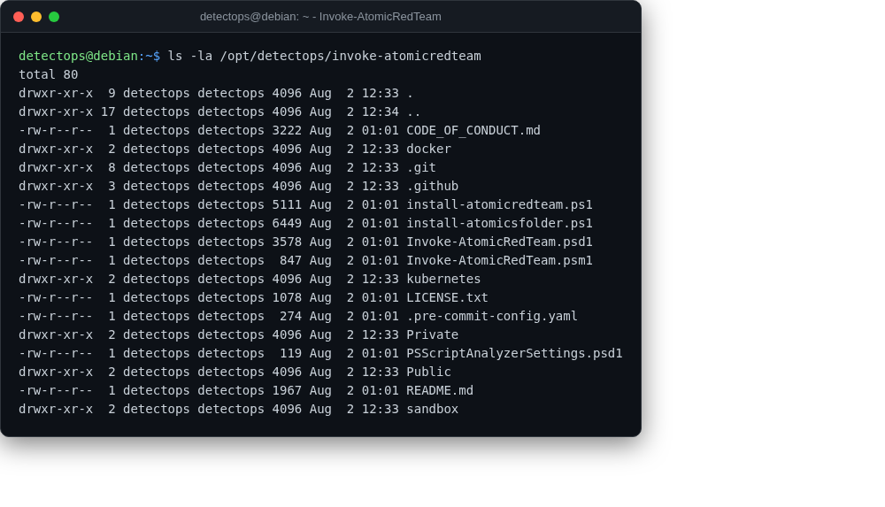

# Invoke-AtomicRedTeam

module

The PowerShell runner for Atomic Red Team. Auto-imported in every pwsh session.

## Location

`/opt/detectops/invoke-atomicredteam`

!!! note
    loaded by `~/.config/powershell/Microsoft.PowerShell_profile.ps1` — nothing to activate manually

---

*Part of the **Attack Simulation** toolset in DetectOps.*
