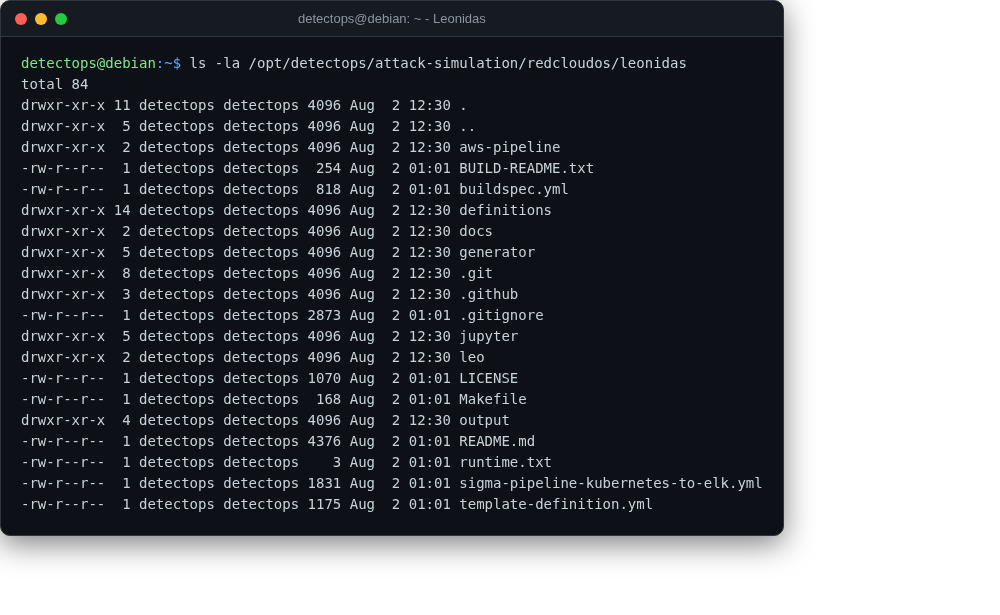

# Leonidas

redcloudos NEW

Automated cloud attack simulation with matching detection use cases, deployed as an AWS Lambda pipeline.

## Location

`/opt/detectops/attack-simulation/redcloudos/leonidas`

!!! warning "Manual step required"
    no fixed run command — deploys via its own Makefile/SAM pipeline into your AWS account; read BUILD-README.txt first

---

*Part of the **Attack Simulation** toolset in DetectOps.*
