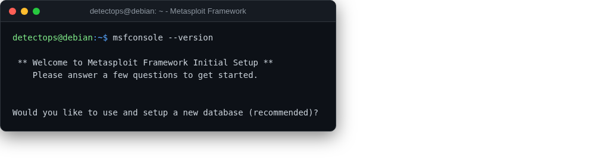

# Metasploit Framework

<span class="cat-badge" style="background:#D9724C">system</span>

Installed system-wide via Rapid7's own installer, fully baked in.



## How to run

```bash
msfconsole
```

## Reference

[https://github.com/rapid7/metasploit-framework](https://github.com/rapid7/metasploit-framework)

---

*Part of the **Attack Simulation** toolset in DetectOps.*
