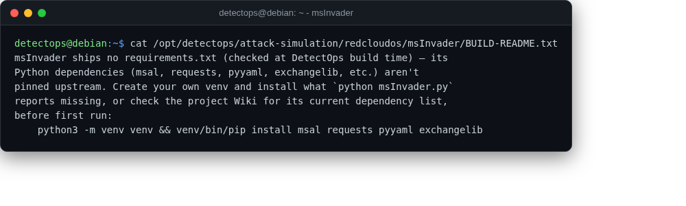

# msInvader

<span class="cat-badge" style="background:#D9724C">redcloudos</span> <span class="new-badge">NEW</span>

Simulates post-compromise M365/Entra ID adversary techniques (mailbox rules, forwarding, delegation) via Graph/EWS/REST.



## Location

`/opt/detectops/attack-simulation/redcloudos/msInvader`

## How to run

```bash
python msInvader.py -c config.yaml
```

!!! warning "Manual step required"
    no pinned requirements.txt upstream — install deps yourself first, see BUILD-README.txt


---

*Part of the **Attack Simulation** toolset in DetectOps.*
