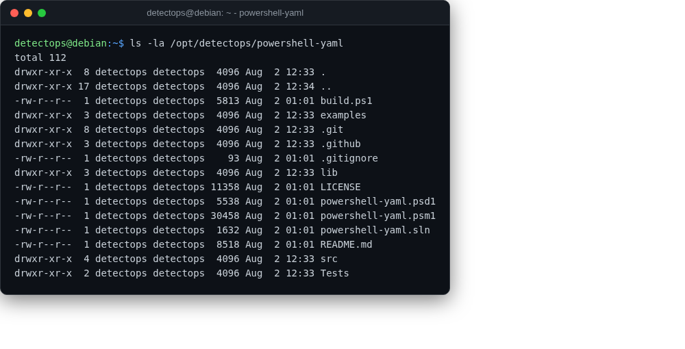

# powershell-yaml

module

YAML parser module Invoke-AtomicRedTeam depends on to read atomic test definitions.

## Location

`/opt/detectops/powershell-yaml`

!!! note
    dependency only — auto-imported, never called directly

## Reference

[https://github.com/cloudbase/powershell-yaml](https://github.com/cloudbase/powershell-yaml)

---

*Part of the **Attack Simulation** toolset in DetectOps.*
