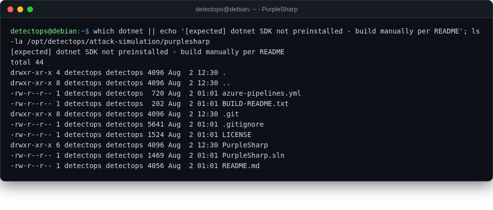

# PurpleSharp

<span class="cat-badge" style="background:#D9724C">.net src</span>

C#/PowerShell adversary simulation, normally compiled fresh per engagement.



## Location

`/opt/detectops/attack-simulation/purplesharp`

## How to run

```bash
dotnet build -c Release   # .NET SDK required
```

!!! warning "Manual step required"
    install a .NET SDK first — not bundled


## Reference

[https://github.com/mvelazc0/PurpleSharp](https://github.com/mvelazc0/PurpleSharp)

---

*Part of the **Attack Simulation** toolset in DetectOps.*
