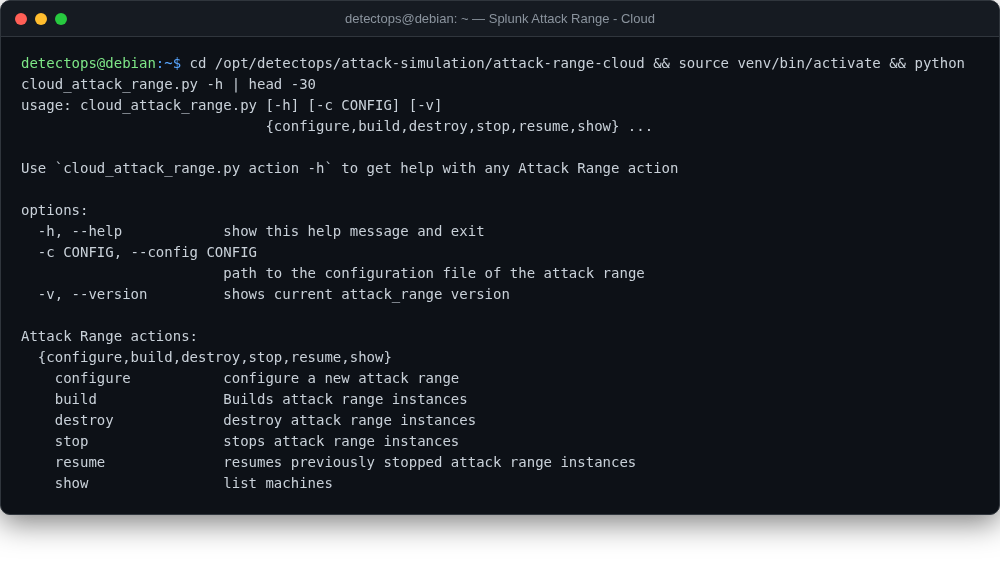

# Splunk Attack Range — Cloud

<span class="cat-badge" style="background:#D9724C">lab / aws</span>

Same lab concept as the Local variant, provisioned as real AWS infrastructure via Terraform instead — not a container, nothing runs locally. Added via the local-tools pipeline.



## Location

`/opt/detectops/attack-simulation/attack-range-cloud`

## How to run

```bash
source venv/bin/activate
aws configure                          # your own AWS credentials — none are bundled
$EDITOR cloud_attack_range.conf        # set key_name, attack_range_password, region
python cloud_attack_range.py configure
python cloud_attack_range.py build     # provisions real AWS infra via Terraform (~15-20 min)
python cloud_attack_range.py show -m   # once build finishes: lists the provisioned machines + their public IPs
```

!!! note
    once `build` finishes, browse to `https://<splunk-public-ip>:8000` (the IP `show -m` just printed) and log in as `admin` / whatever you set `attack_range_password` to in the .conf — change it from the template's default before you build


!!! warning "Manual step required"
    provisions real, billable AWS resources (EC2, EKS) — always run `python cloud_attack_range.py destroy` when finished. `cloud_provider = azure` exists as a config option in the code, but this build only vendors the AWS Terraform module (no `terraform/azure/`) — AWS is the only cloud target that actually works here.


## Reference

[https://github.com/splunk/attack_range_cloud](https://github.com/splunk/attack_range_cloud)

---

*Part of the **Attack Simulation** toolset in DetectOps.*
