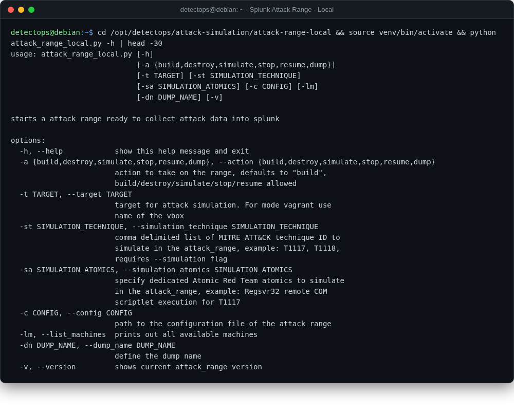

# Splunk Attack Range — Local

<span class="cat-badge" style="background:#D9724C">lab</span>

Vagrant+Ansible lab builder — Windows DC/Server, Splunk Server, Kali, CALDERA/Phantom servers, on VirtualBox. Added via the local-tools pipeline.



## Location

`/opt/detectops/attack-simulation/attack-range-local`

## How to run

```bash
source venv/bin/activate
python attack_range_local.py -a build
```

!!! warning "Manual step required"
    needs VT-x/AMD-V in firmware, internet on first build (downloads Splunk + Vagrant boxes), and RAM/CPU sized to the VMs enabled in attack_range_local.conf — change the default admin password there first


## Reference

[https://github.com/splunk/attack_range_local](https://github.com/splunk/attack_range_local)

---

*Part of the **Attack Simulation** toolset in DetectOps.*
