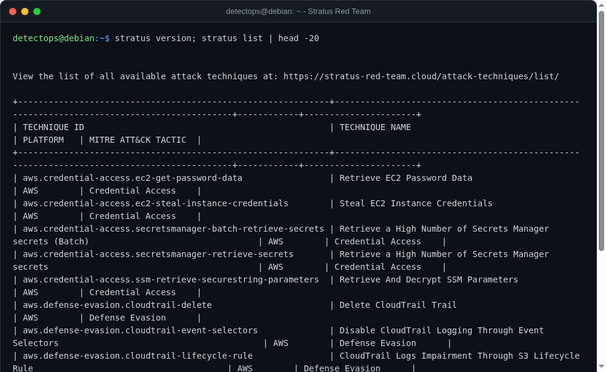

# Stratus Red Team

<span class="cat-badge" style="background:#D9724C">binary</span>

DataDog's granular attack-technique emulation for AWS/Azure/GCP/K8s.



## Location

`/usr/local/bin/stratus`

## How to run

```bash
stratus detonate aws.credential-access.ec2-get-password-data
```

---

*Part of the **Attack Simulation** toolset in DetectOps.*
