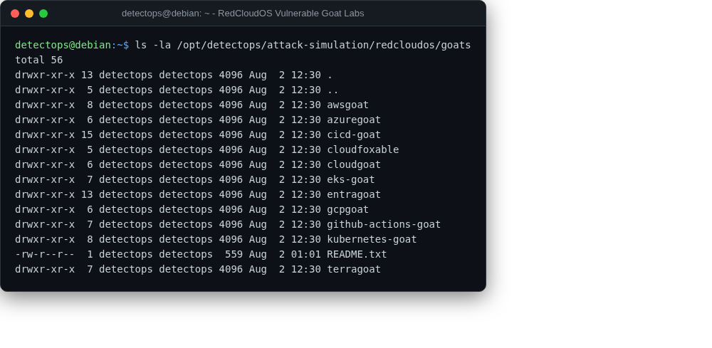

# Vulnerable cloud/K8s/CI-CD labs (RedCloudOS "goat" set)

lab / billable NEW

11 intentionally-vulnerable environments cloned as editable source: AzureGoat, AWSGoat, GCPGoat, EntraGoat, CloudGoat, CloudFoxable, Kubernetes Goat, EKS Goat, TerraGoat, CI/CD Goat, GitHub Actions Goat.

## Location

`/opt/detectops/attack-simulation/redcloudos/goats/<name>`

!!! warning "Manual step required"
    none are deployed at build time — each provisions real, billable cloud infra (or, for Kubernetes Goat / CI/CD Goat, local Docker) via its own script using your own credentials; always run its teardown step when done. See goats/README.txt

---

*Part of the **Attack Simulation** toolset in DetectOps.*
