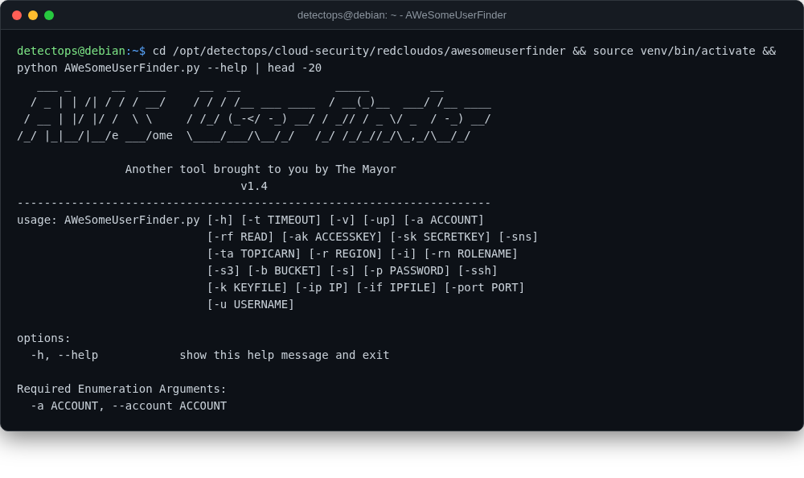

# AWeSomeUserFinder

<span class="cat-badge" style="background:#4FB4BE">redcloudos</span> <span class="new-badge">NEW</span>

AWS IAM username enumeration and password-spraying tool.



## Location

`/opt/detectops/cloud-security/redcloudos/awesomeuserfinder`

## How to run

```bash
source venv/bin/activate && python AWeSomeUserFinder.py
```

## Reference

[https://github.com/RedCloudOS/AWeSomeUserFinder](https://github.com/RedCloudOS/AWeSomeUserFinder)

---

*Part of the **Cloud & Kubernetes Security** toolset in DetectOps.*
