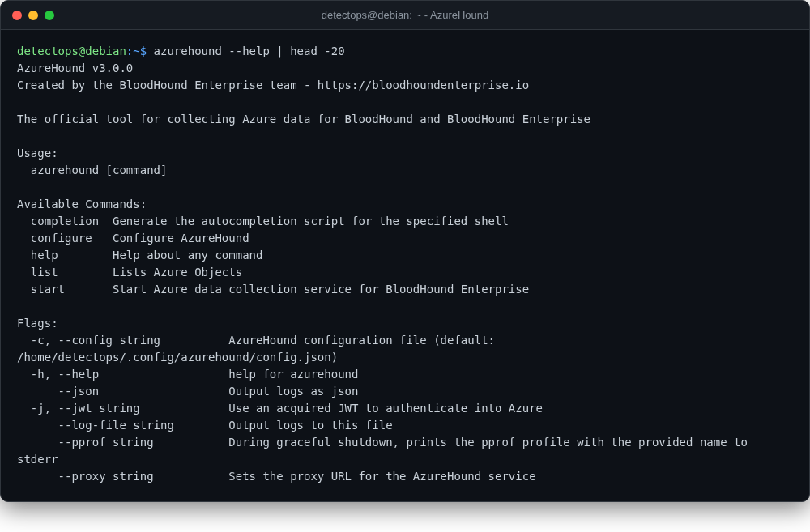

# AzureHound

<span class="cat-badge" style="background:#4FB4BE">binary</span> <span class="new-badge">NEW</span>

BloodHound-style attack-path data collector for Entra ID/Azure (SpecterOps).



## How to run

```bash
azurehound list --refresh-token <token> -o output.json
```

## Reference

[https://github.com/SpecterOps/AzureHound](https://github.com/SpecterOps/AzureHound)

---

*Part of the **Cloud & Kubernetes Security** toolset in DetectOps.*
