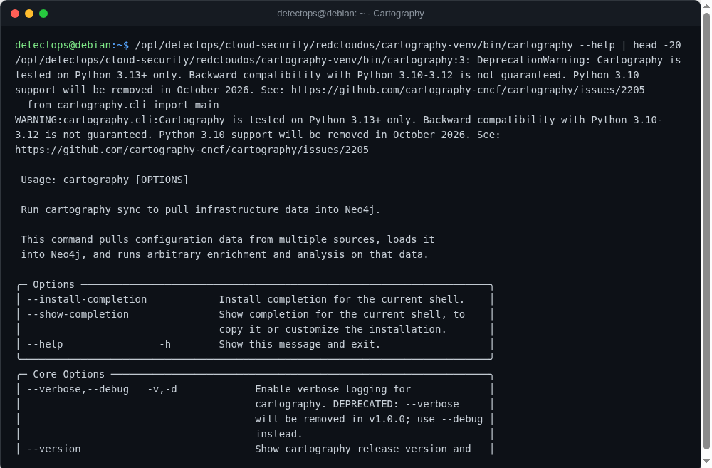

# Cartography

venv NEW

Lyft's infrastructure asset-graph tool — ingests AWS/Azure/GCP/K8s state into Neo4j for attack-path queries.

## Location

`/opt/detectops/cloud-security/redcloudos/cartography-venv`

!!! warning "Manual step required"
    needs a running Neo4j instance to write into — not bundled (same offline policy as the heavy SIEM stacks)

## Reference

[https://github.com/cartography-cncf/cartography](https://github.com/cartography-cncf/cartography)

---

*Part of the **Cloud & Kubernetes Security** toolset in DetectOps.*
