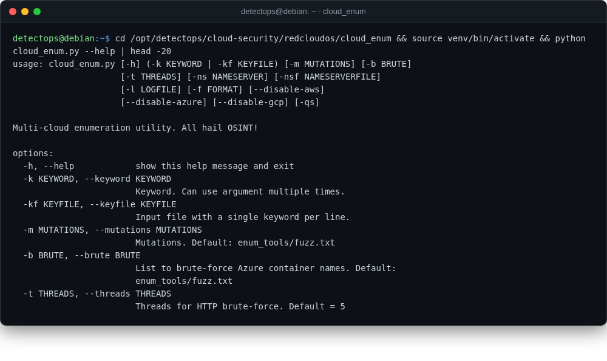

# cloud_enum

<span class="cat-badge" style="background:#4FB4BE">redcloudos</span> <span class="new-badge">NEW</span>

Multi-cloud OSINT enumeration of public resources across AWS/Azure/GCP.



## Location

`/opt/detectops/cloud-security/redcloudos/cloud_enum`

## How to run

```bash
source venv/bin/activate && python cloud_enum.py -k keyword
```

---

*Part of the **Cloud & Kubernetes Security** toolset in DetectOps.*
