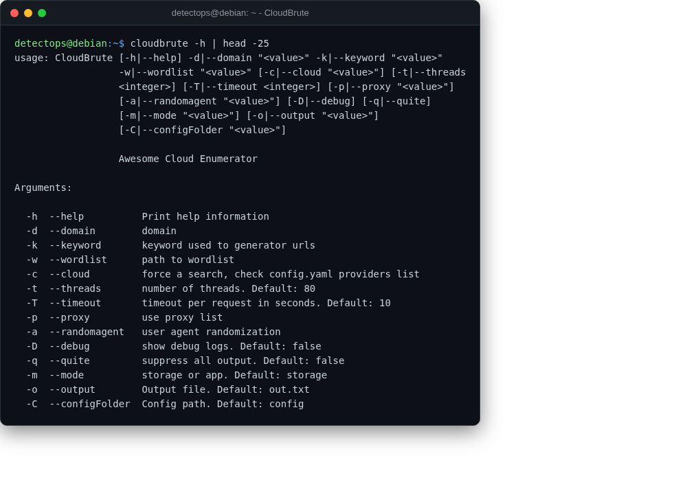

# CloudBrute

<span class="cat-badge" style="background:#4FB4BE">binary</span> <span class="new-badge">NEW</span>

Cloud infrastructure/asset enumerator across AWS/Azure/GCP/DigitalOcean/etc.



## Location

`/opt/detectops/cloud-security/redcloudos/cloudbrute` (needs its bundled config/data dirs, wrapped by the launcher below)

## How to run

```bash
cloudbrute -d target.com -k company -w data/storage_small.txt
```

!!! warning "Manual step required"
    -w/wordlist is required (not optional); config folder defaults to ./config, no need to pass -C since the launcher already cd's into the tool's own directory


---

*Part of the **Cloud & Kubernetes Security** toolset in DetectOps.*
