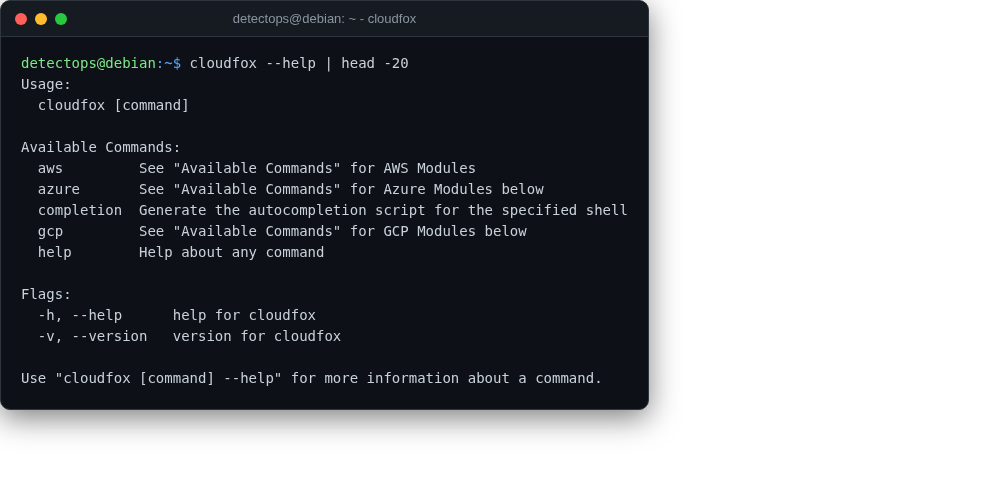

# cloudfox

<span class="cat-badge" style="background:#4FB4BE">binary</span> <span class="new-badge">NEW</span>

Situational-awareness enumeration for cloud penetration tests (BishopFox).



## How to run

```bash
cloudfox aws all-checks
```

## Reference

[https://github.com/BishopFox/cloudfox](https://github.com/BishopFox/cloudfox)

---

*Part of the **Cloud & Kubernetes Security** toolset in DetectOps.*
