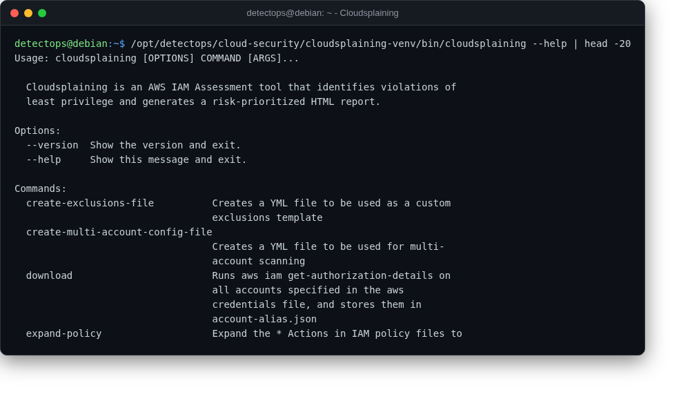

# Cloudsplaining

<span class="cat-badge" style="background:#4FB4BE">venv</span>

Flags risky AWS IAM policies (privilege escalation, wildcard actions).



## Location

`/opt/detectops/cloud-security/cloudsplaining-venv`

## How to run

```bash
cloudsplaining-venv/bin/cloudsplaining scan --profile default
```

---

*Part of the **Cloud & Kubernetes Security** toolset in DetectOps.*
