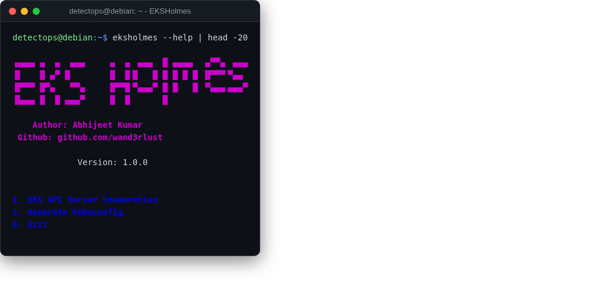

# EKSHolmes

<span class="cat-badge" style="background:#4FB4BE">redcloudos</span> <span class="new-badge">NEW</span>

Enumerates AWS EKS clusters (RedCloudOS's own tool). No upstream release exists — built from Go source at ISO build time.



## How to run

```bash
eksholmes
```

---

*Part of the **Cloud & Kubernetes Security** toolset in DetectOps.*
