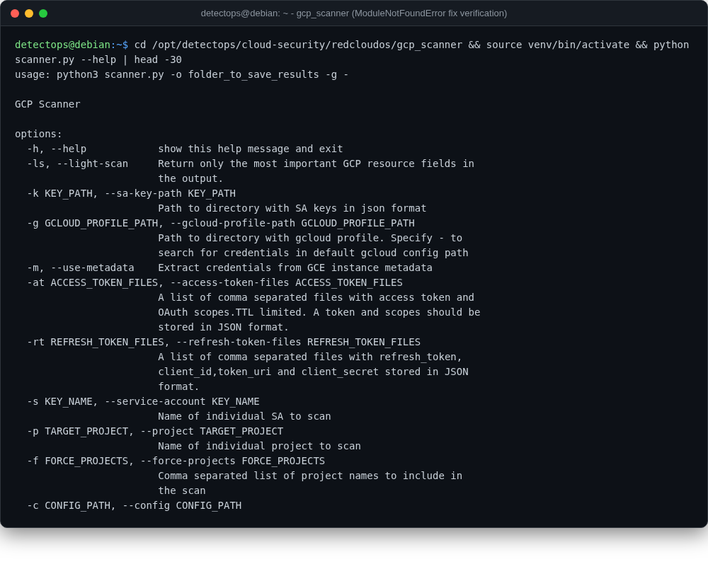

# gcp_scanner

<span class="cat-badge" style="background:#4FB4BE">redcloudos</span> <span class="new-badge">NEW</span>

Comprehensive scanner for exposed/misconfigured Google Cloud resources.



## Location

`/opt/detectops/cloud-security/redcloudos/gcp_scanner`

## How to run

```bash
source venv/bin/activate && python scanner.py
```

---

*Part of the **Cloud & Kubernetes Security** toolset in DetectOps.*
