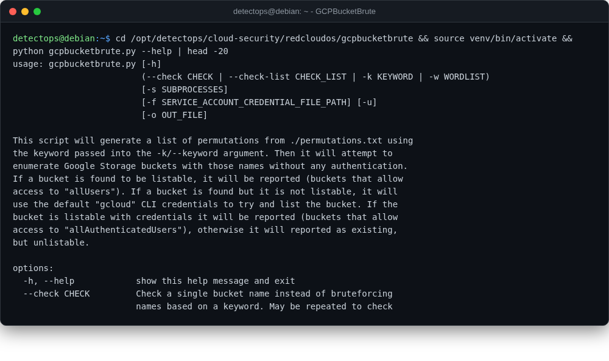

# GCPBucketBrute

<span class="cat-badge" style="background:#4FB4BE">redcloudos</span> <span class="new-badge">NEW</span>

Enumerates GCS bucket names and checks/privesc's your access to each.



## Location

`/opt/detectops/cloud-security/redcloudos/gcpbucketbrute`

## How to run

```bash
source venv/bin/activate && python gcpbucketbrute.py -k keyword
```

## Reference

[https://github.com/RedCloudOS/GCPBucketBrute](https://github.com/RedCloudOS/GCPBucketBrute)

---

*Part of the **Cloud & Kubernetes Security** toolset in DetectOps.*
