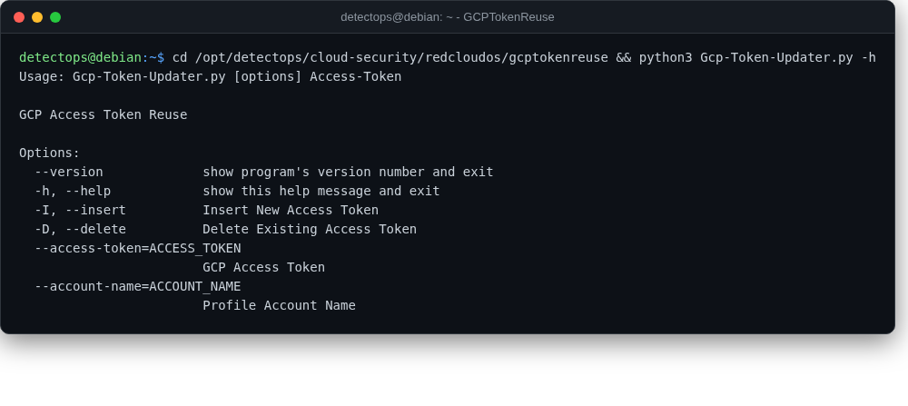

# GCPTokenReuse

<span class="cat-badge" style="background:#4FB4BE">redcloudos</span> <span class="new-badge">NEW</span>

Single-script tool that reuses a compromised GCP OAuth token across scopes/services.



## Location

`/opt/detectops/cloud-security/redcloudos/gcptokenreuse`

## How to run

```bash
python Gcp-Token-Updater.py
```

---

*Part of the **Cloud & Kubernetes Security** toolset in DetectOps.*
