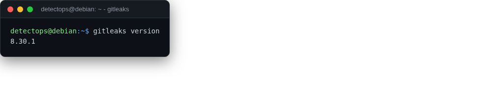

# gitleaks

<span class="cat-badge" style="background:#4FB4BE">binary</span> <span class="new-badge">NEW</span>

Scans git history/filesystems for hardcoded secrets and credentials.



## How to run

```bash
gitleaks detect -v
```

---

*Part of the **Cloud & Kubernetes Security** toolset in DetectOps.*
