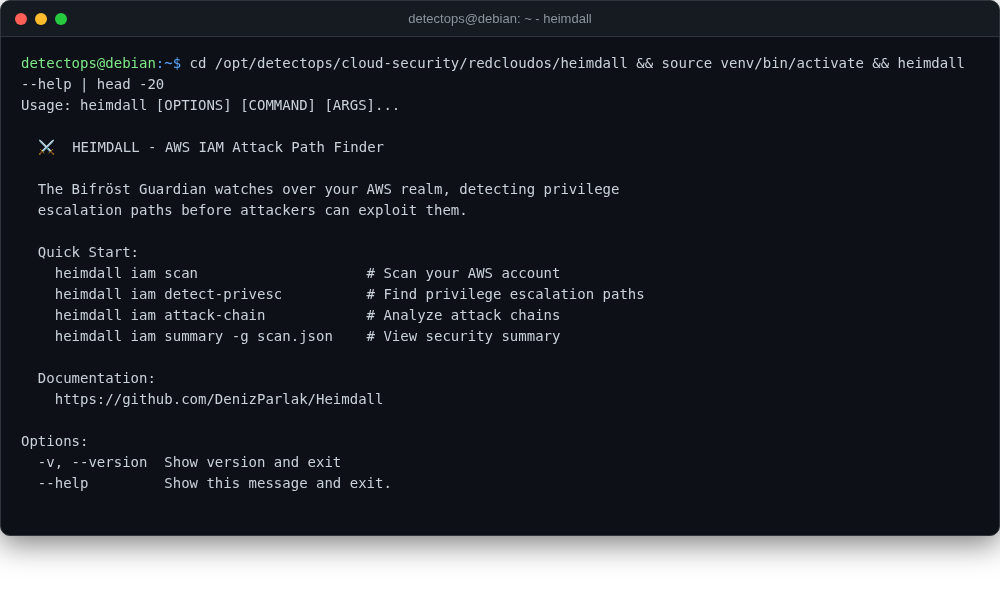

# heimdall

<span class="cat-badge" style="background:#4FB4BE">redcloudos</span> <span class="new-badge">NEW</span>

AWS attack-path scanner covering privilege escalation across 10+ services.



## Location

`/opt/detectops/cloud-security/redcloudos/heimdall`

## How to run

```bash
source venv/bin/activate && heimdall iam scan
```

---

*Part of the **Cloud & Kubernetes Security** toolset in DetectOps.*
