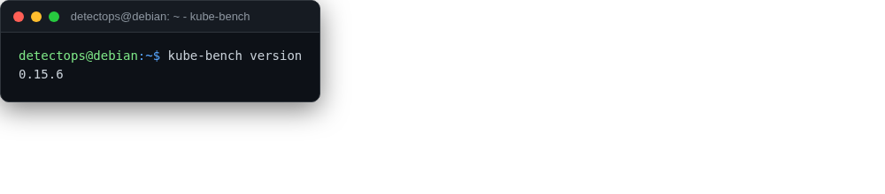

# kube-bench

<span class="cat-badge" style="background:#4FB4BE">binary</span>

Checks a cluster against the CIS Kubernetes Benchmark.



## Location

`/usr/local/bin/kube-bench`

## How to run

```bash
kube-bench run
```

## Reference

[https://github.com/aquasecurity/kube-bench](https://github.com/aquasecurity/kube-bench)

---

*Part of the **Cloud & Kubernetes Security** toolset in DetectOps.*
