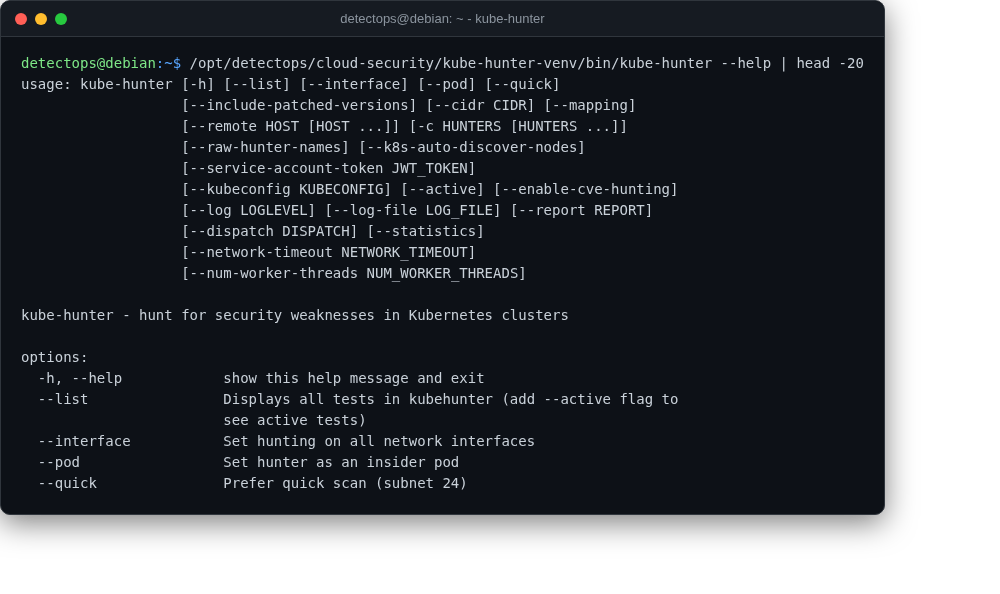

# kube-hunter

<span class="cat-badge" style="background:#4FB4BE">venv</span>

Hunts for exploitable weaknesses in a Kubernetes cluster.



## Location

`/opt/detectops/cloud-security/kube-hunter-venv`

## How to run

```bash
kube-hunter-venv/bin/kube-hunter --remote <cluster-ip>
```

---

*Part of the **Cloud & Kubernetes Security** toolset in DetectOps.*
