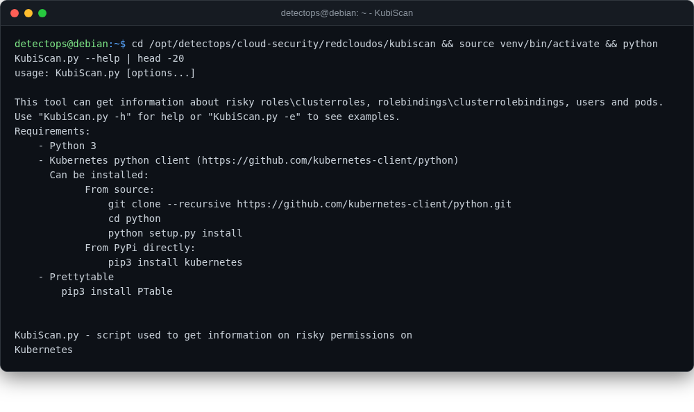

# KubiScan

<span class="cat-badge" style="background:#4FB4BE">redcloudos</span> <span class="new-badge">NEW</span>

Scans a Kubernetes cluster for risky RBAC roles/bindings and risky pods.



## Location

`/opt/detectops/cloud-security/redcloudos/kubiscan`

## How to run

```bash
source venv/bin/activate && python KubiScan.py
```

## Reference

[https://github.com/RedCloudOS/KubiScan](https://github.com/RedCloudOS/KubiScan)

---

*Part of the **Cloud & Kubernetes Security** toolset in DetectOps.*
