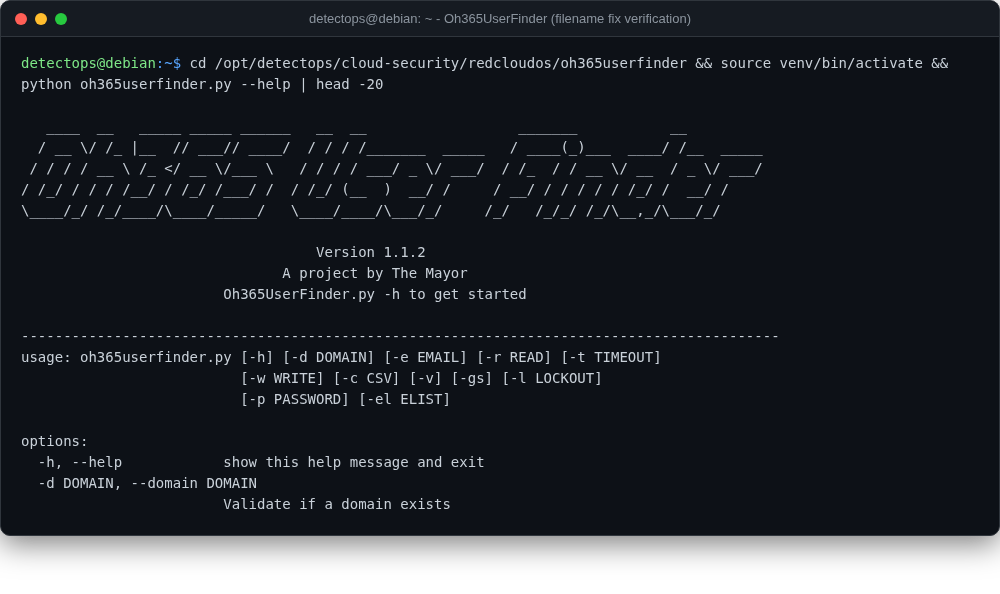

# Oh365UserFinder

<span class="cat-badge" style="background:#4FB4BE">redcloudos</span> <span class="new-badge">NEW</span>

Office 365 / Entra ID username enumeration tool.



## Location

`/opt/detectops/cloud-security/redcloudos/oh365userfinder`

## How to run

```bash
source venv/bin/activate && python oh365userfinder.py -d target.com
```

## Reference

[https://github.com/RedCloudOS/Oh365UserFinder](https://github.com/RedCloudOS/Oh365UserFinder)

---

*Part of the **Cloud & Kubernetes Security** toolset in DetectOps.*
