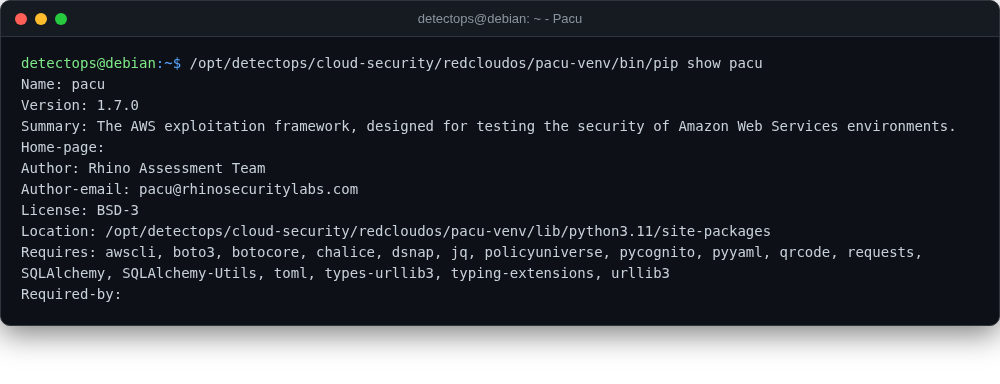

# Pacu

<span class="cat-badge" style="background:#4FB4BE">venv</span> <span class="new-badge">NEW</span>

Rhino Security Labs' AWS exploitation framework — post-compromise enumeration and attack modules.



## Location

`/opt/detectops/cloud-security/redcloudos/pacu-venv`

## How to run

```bash
pacu-venv/bin/pacu
```

## Reference

[https://github.com/RhinoSecurityLabs/pacu](https://github.com/RhinoSecurityLabs/pacu)

---

*Part of the **Cloud & Kubernetes Security** toolset in DetectOps.*
