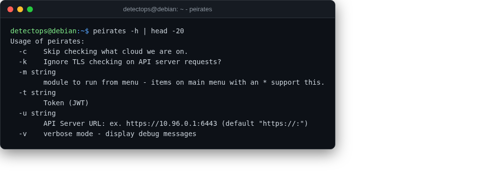

# peirates

<span class="cat-badge" style="background:#4FB4BE">binary</span> <span class="new-badge">NEW</span>

Kubernetes penetration-testing tool for privilege escalation inside a cluster.



## How to run

```bash
peirates
```

---

*Part of the **Cloud & Kubernetes Security** toolset in DetectOps.*
