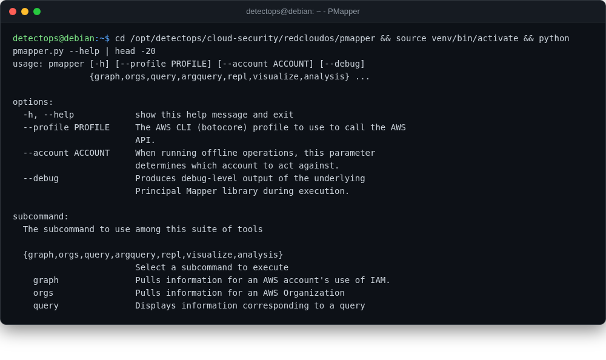

# PMapper

<span class="cat-badge" style="background:#4FB4BE">redcloudos</span> <span class="new-badge">NEW</span>

Evaluates AWS IAM permissions to find privilege-escalation paths (NCC Group original, RedCloudOS fork).



## Location

`/opt/detectops/cloud-security/redcloudos/pmapper`

## How to run

```bash
source venv/bin/activate && python pmapper.py graph create
```

!!! warning "Manual step required"
    only requirements.txt gets installed (not a full package install), so use the bundled `pmapper.py` wrapper — a bare `pmapper` command isn't registered


## Reference

[https://github.com/RedCloudOS/PMapper](https://github.com/RedCloudOS/PMapper)

---

*Part of the **Cloud & Kubernetes Security** toolset in DetectOps.*
