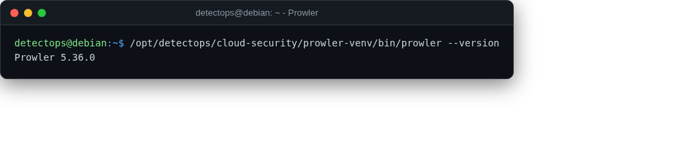

# Prowler

<span class="cat-badge" style="background:#4FB4BE">venv</span>

AWS/Azure/GCP/K8s CIS-benchmark and best-practice auditing.



## Location

`/opt/detectops/cloud-security/prowler-venv`

## How to run

```bash
prowler-venv/bin/prowler aws
```

## Reference

[https://github.com/prowler-cloud/prowler](https://github.com/prowler-cloud/prowler)

---

*Part of the **Cloud & Kubernetes Security** toolset in DetectOps.*
