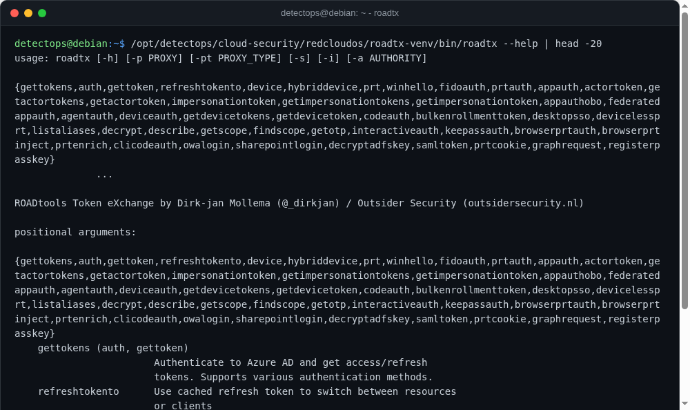

# roadtx

<span class="cat-badge" style="background:#4FB4BE">venv</span> <span class="new-badge">NEW</span>

ROADtools' Entra ID/Azure AD token-exchange and authentication toolkit.



## Location

`/opt/detectops/cloud-security/redcloudos/roadtx-venv`

## How to run

```bash
roadtx-venv/bin/roadtx interactiveauth
```

## Reference

[https://github.com/dirkjanm/ROADtools](https://github.com/dirkjanm/ROADtools)

---

*Part of the **Cloud & Kubernetes Security** toolset in DetectOps.*
