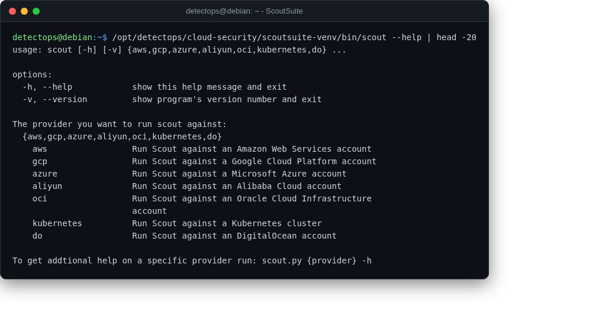

# ScoutSuite

<span class="cat-badge" style="background:#4FB4BE">venv</span>

Multi-cloud security-posture auditing (AWS/Azure/GCP/…) with an HTML report.



## Location

`/opt/detectops/cloud-security/scoutsuite-venv`

## How to run

```bash
scoutsuite-venv/bin/scout aws
```

---

*Part of the **Cloud & Kubernetes Security** toolset in DetectOps.*
