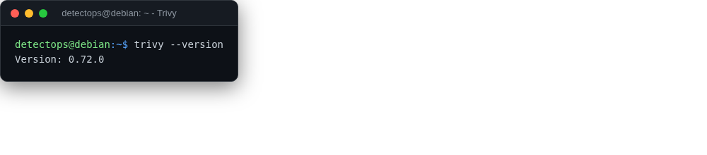

# Trivy

<span class="cat-badge" style="background:#4FB4BE">system</span>

Vulnerability/misconfig scanner for images, filesystems, and IaC.



## How to run

```bash
trivy image nginx:latest
```

---

*Part of the **Cloud & Kubernetes Security** toolset in DetectOps.*
