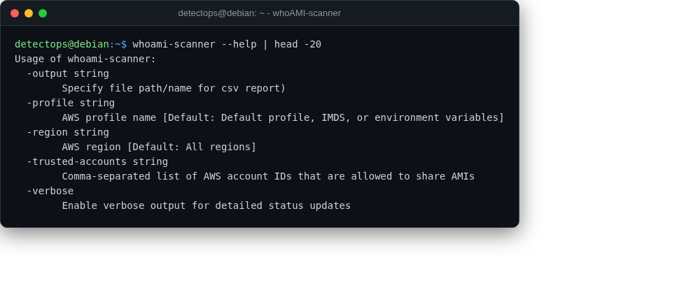

# whoAMI-scanner

<span class="cat-badge" style="background:#4FB4BE">binary</span> <span class="new-badge">NEW</span>

Scans an AWS account for the "whoAMI" AMI name-confusion attack (Datadog).



## How to run

```bash
whoami-scanner
```

---

*Part of the **Cloud & Kubernetes Security** toolset in DetectOps.*
