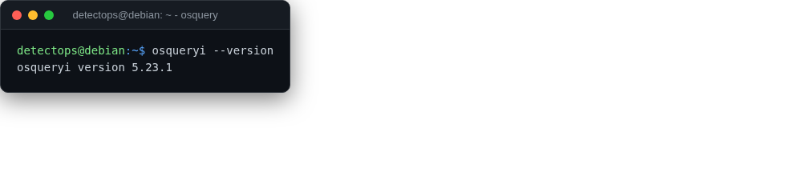

# osquery

<span class="cat-badge" style="background:#4CA593">system</span>

SQL-queryable endpoint telemetry — ask the OS questions like a database.



## How to run

```bash
osqueryi
```

## Reference

[https://github.com/osquery/osquery](https://github.com/osquery/osquery)

---

*Part of the **Detection Engineering** toolset in DetectOps.*
