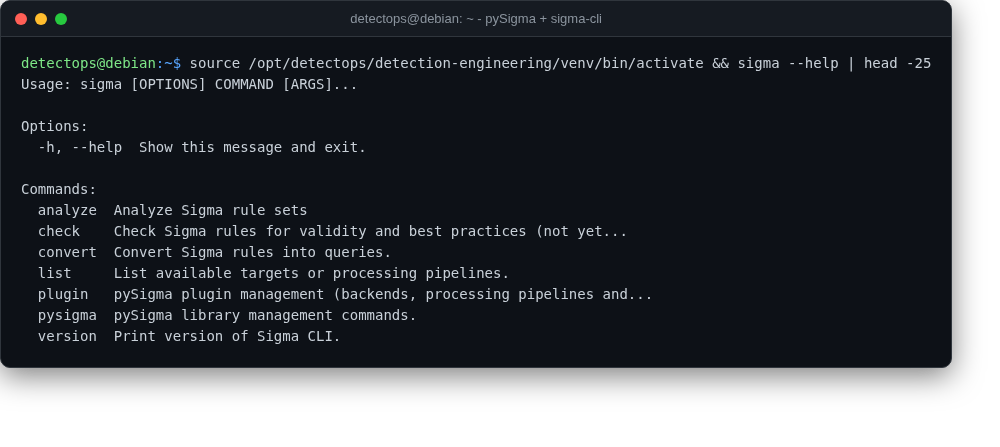

# pySigma + sigma-cli

<span class="cat-badge" style="background:#4CA593">venv</span>

Converts Sigma rules to real backend queries (Splunk, Elastic, and friends).



## Location

`/opt/detectops/detection-engineering/venv`

## How to run

```bash
source /opt/detectops/detection-engineering/venv/bin/activate
sigma convert -t splunk -p sysmon rule.yml
```

---

*Part of the **Detection Engineering** toolset in DetectOps.*
