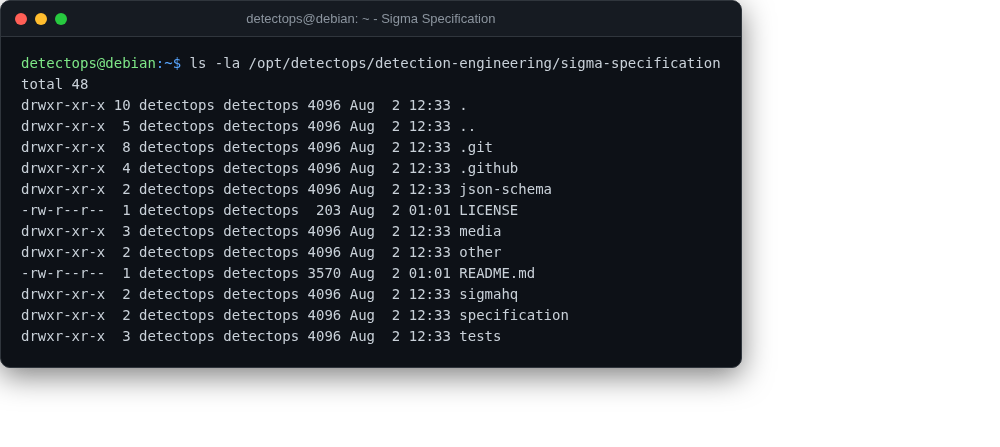

# Sigma specification

spec

The formal Sigma rule-format spec, for reference while writing new rules.

## Location

`/opt/detectops/detection-engineering/sigma-specification`

## Reference

[https://github.com/SigmaHQ/sigma-specification](https://github.com/SigmaHQ/sigma-specification)

---

*Part of the **Detection Engineering** toolset in DetectOps.*
