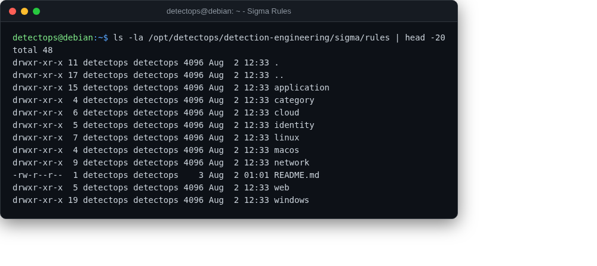

# Sigma

rules

SigmaHQ's full rule corpus and tooling — a real git clone, so edit and branch freely.

## Location

`/opt/detectops/detection-engineering/sigma`

## Reference

[https://github.com/SigmaHQ/sigma](https://github.com/SigmaHQ/sigma)

---

*Part of the **Detection Engineering** toolset in DetectOps.*
