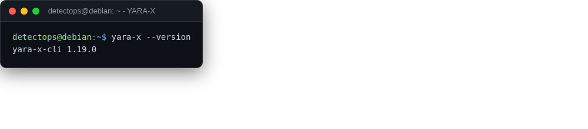

# YARA-X

binary

The Rust rewrite of YARA — faster, stricter rule parsing.

## Location

`/usr/local/bin/yara-x`

## Reference

[https://github.com/VirusTotal/yara-x](https://github.com/VirusTotal/yara-x)

---

*Part of the **Detection Engineering** toolset in DetectOps.*
