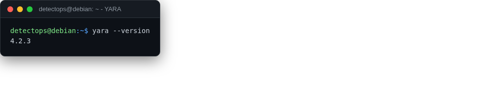

# YARA

<span class="cat-badge" style="background:#4CA593">binary</span>

The classic pattern-matching engine for files and memory.



## How to run

```bash
yara rule.yar sample.bin
```

## Reference

[https://github.com/VirusTotal/yara](https://github.com/VirusTotal/yara)

---

*Part of the **Detection Engineering** toolset in DetectOps.*
