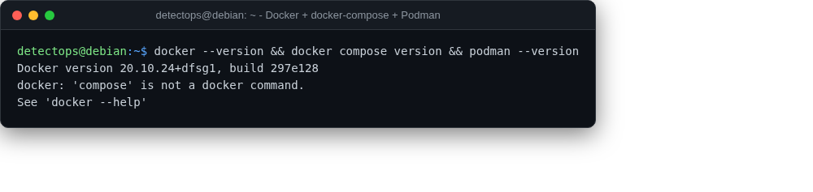

# Docker + docker-compose + Podman

<span class="cat-badge" style="background:#C2A544">system</span>

Every compose-based stack above runs on the hyphenated v1 `docker-compose` — the v2 plugin isn't in Debian's own repos.



## How to run

```bash
docker ps
docker-compose up -d
```

---

*Part of the **Dev / Scripting Toolchain** toolset in DetectOps.*
