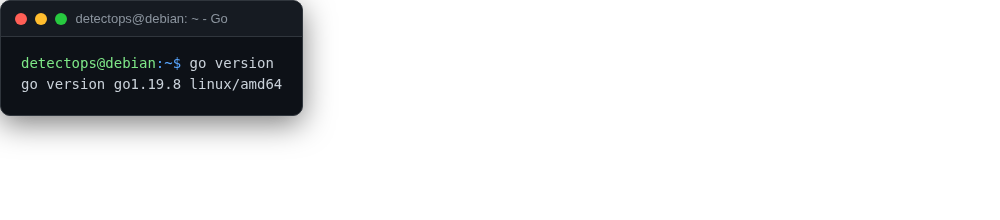

# Go

<span class="cat-badge" style="background:#C2A544">system</span>

For building any of the Go-based tools from source.



## How to run

```bash
go build ./...
```

## Reference

[https://go.dev/](https://go.dev/)

---

*Part of the **Dev / Scripting Toolchain** toolset in DetectOps.*
